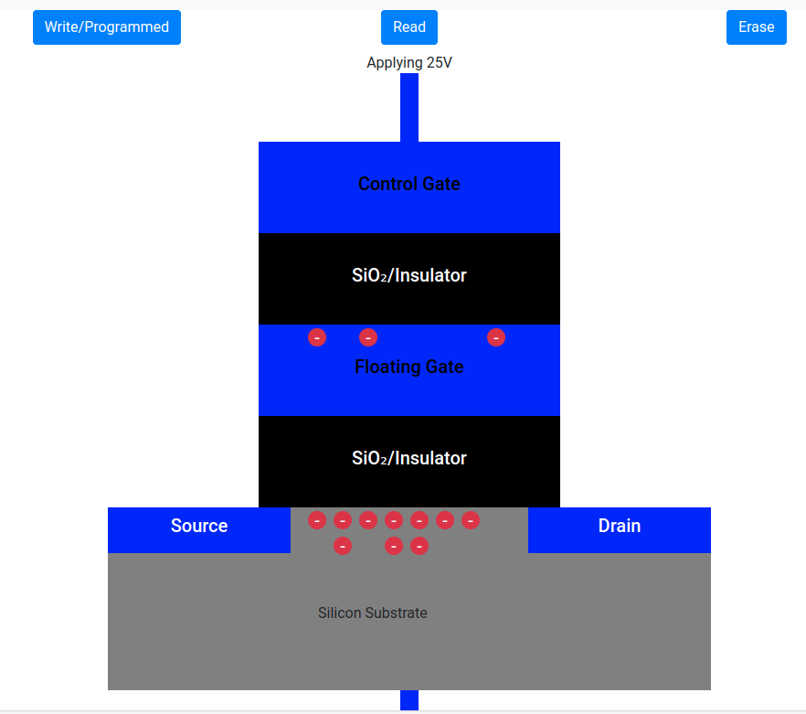
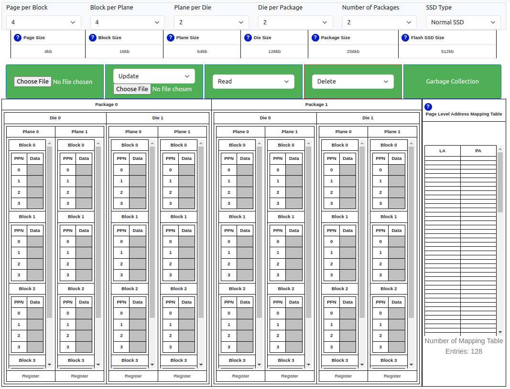

<h1 align="center">
  <strong><a href="https://schoolofthought.tech/templates/flash_memory.html">Eyana: The SSD Simulator</a></strong>
</h1>
# Abstract 
Understanding the intricacies of Flash SSD technology can be challenging for students without a solid foundation. To address this issue, we developed Eyana: The SSD Simulator, a web-based tool aimed at simplifying the comprehension of Flash SSD operations. Eyana provides a visual representation of Write, Read, Update, Delete, garbage collection, and flash translation layer processes, along with supporting documentation on concepts like Write Amplification, Wear Leveling, Parallelism, and Multi-Channel. By allowing users to upload files and observe real-time operations, Eyana enables students to understand the complete procedure within a short timeframe. In a survey conducted to evaluate its effectiveness, 99 percent of users regarded Eyana as an exceptionally valuable and one of the best simulators available. In this paper, we present an in-depth overview of Eyana, highlighting its features, functionalities, and its impact on enhancing the understanding of Flash SSD technology. Additionally, we discuss the results of the survey, affirming the simulator's efficacy in facilitating the comprehension of Flash SSDs.

# Introduction 
Understanding the core concepts of Flash SSD can be a challenging task for students. Many of us face difficulties comprehending the intricate workings of Flash SSD due to the lack of foundational knowledge. Despite our efforts to find a web-based Flash SSD simulator, we were unable to locate one. Consequently, we took it upon ourselves to develop an easily understandable web-based simulator called Eyana: The SSD Simulator. The name "Eyana" was inspired by one of our team members' daughters.

Our simulator, Eyana, is designed with the aim of simplifying the comprehension of Flash SSD technology. It achieves this by providing visual demonstrations of crucial operations like Page, Block, Write, Read, Update, Delete, garbage collection, and the flash translation layer. The entire process of how transistors come together to form pages, and how pages combine to form blocks, ultimately creating an SSD, is visually presented in our simulator. Accompanied by comprehensive documentation, we clarify concepts such as Write Amplification, Wear Leveling, Parallelism, and Multi-Channel.

Through visualization, Eyana offers valuable insights into the functioning of Flash SSDs, shedding light on the selection of pages and blocks during various operations such as writing, reading, updating, and deleting. Furthermore, the simulator illustrates the intricate workings of the garbage collection process, adding to the overall understanding of Flash SSD technology.

By allowing users to upload files and observe real-time operations, our simulator empowers students to grasp the entire procedure within a short span of time. With a survey conducted to assess the effectiveness of our simulator in enhancing the understanding of Flash SSDs, we obtained valuable feedback. Remarkably, 99 per cent of the users found our simulator to be highly effective, rating it as one of the best available.

In this paper, we will delve into the details of Eyana: The SSD Simulator and provide a comprehensive overview of its features, functionalities, and the underlying concepts it aims to elucidate. We will also present the results of our survey, conducted to evaluate the simulator's effectiveness in facilitating the comprehension of Flash SSDs. Through this research, we aim to contribute to the educational resources available for students and researchers interested in Flash SSD technology.

# Motivation 
The development of Eyana: The SSD Simulator arose from a pressing need within the educational community to bridge the gap in understanding and comprehension of Flash SSD technology. Recognizing the challenges faced by students in grasping the intricate workings of Flash SSDs, our team embarked on a mission to create a user-friendly and visually immersive simulator that simplifies the core concepts of Flash SSDs.

The motivation behind Eyana stems from the lack of easily accessible web-based simulators catering specifically to Flash SSD technology. Despite diligent efforts to locate such a tool, students and researchers often find themselves struggling to comprehend the foundational knowledge required to fully grasp the intricacies of Flash SSDs. Eyana aims to fill this void by offering an intuitive and interactive platform that enables users to visualize critical operations and understand the underlying concepts with ease.

By providing visual demonstrations of essential operations such as Page, Block, Write, Read, Update, Delete, garbage collection, and the flash translation layer, Eyana empowers users to gain valuable insights into the inner workings of Flash SSDs. The simulator offers a comprehensive understanding of how transistors come together to form pages and how pages combine to form blocks, ultimately creating a functional SSD.

Furthermore, Eyana elucidates key concepts like Write Amplification, Wear Leveling, Parallelism, and Multi-Channel through visual aids and comprehensive documentation. Users can observe real-time operations by uploading files, facilitating a hands-on learning experience that accelerates the comprehension of Flash SSD technology.

The motivation behind our research and the development of Eyana is further reinforced by the overwhelmingly positive feedback received from users. The survey conducted to assess the simulator's effectiveness revealed that 99 percent of users found Eyana to be highly effective and rated it as one of the best available resources for understanding Flash SSDs.

By presenting an in-depth overview of Eyana's features, functionalities, and the underlying concepts it aims to clarify, this paper seeks to contribute to the educational resources available for students and researchers interested in Flash SSD technology. Our motivation is rooted in the belief that a visually engaging and user-friendly simulator like Eyana can significantly enhance the learning experience, empowering individuals to grasp the complexities of Flash SSDs in a short span of time.

In conclusion, Eyana: The SSD Simulator emerges as a promising solution to the challenges faced by students and researchers in comprehending Flash SSD technology. By providing an intuitive and visually immersive platform, Eyana fills the void in web-based simulators for Flash SSDs, allowing users to gain a comprehensive understanding of the technology. Through this research, we aim to provide a valuable educational resource and contribute to the advancement of knowledge in the field of Flash SSD technology.
# Related Work 
There are many papers in the field of SSD simulation, each exploring various aspects to build efficient and accurate simulators. For instance, the FEMU paper focuses on creating a cheap and scalable flash emulator for full-stack SSD research. MQSim-E aims to enhance SSD simulation specifically for enterprise SSDs by incorporating critical functionalities. VSSIM offers a virtual machine-based SSD simulator with real-time performance analysis and flexibility. SimpleSSD provides a high-fidelity simulator that models detailed hardware and software characteristics.

However, our paper, "Eyana: The SSD Simulator," takes a unique approach to simplify the understanding of SSD technology for a broader audience, especially students. Unlike other simulators mentioned in the related work, Eyana is web-based, making it easily accessible to anyone without requiring prior knowledge or technical expertise. It focuses on visual demonstrations of key SSD operations, such as page, block, write, read, and garbage collection. By providing real-time interactions and allowing users to upload files, Eyana empowers learners to grasp the SSD working procedure intuitively.

While other simulators cater to research-specific needs or performance analysis, Eyana's main goal is to serve as an educational tool. It offers a user-friendly interface and comprehensive documentation, clarifying complex concepts like Write Amplification, Wear Leveling, and Parallelism. Our survey results show that Eyana has been highly effective in enhancing users' understanding of Flash SSDs, making it one of the best available resources for SSD education.

# Floating Gate Transistor Simulator
A Solid State Drive (SSD) is a cutting-edge data storage device based on flash memory technology, utilizing floating gate transistors to store data as electrical charges. Unlike traditional hard drives with moving mechanical parts, SSDs offer a multitude of advantages, including higher speed, enhanced reliability, and lower power consumption, making them the preferred choice for modern computing needs.

With the aid of our Floating Gate Transistor simulator, users can not only grasp the fundamental operations of writing, reading, and erasing data but also gain a comprehensive understanding of the key distinctions between Single-Level Cell (SLC), Multi-Level Cell (MLC), and Triple-Level Cell (TLC) technologies. The simulator offers a hands-on experience in programming floating gate transistors to store varying levels of charge, enabling users to observe the differences in data storage capacity and performance among these three memory cell types. By exploring these nuances, users can appreciate the significance of SLC, MLC, and TLC technologies in diverse applications and make informed decisions about their implementation based on specific use cases and performance requirements.

## Floating Gate Transistors - The Heart of SSDs
Each SSD's fundamental building block is the floating gate transistor, consisting of a source, drain, silicon insulator, a floating gate, and a control gate(figure 1). The magic of data storage happens when a high voltage(25v example) is applied to the control gate, allowing electrons from the silicon substrate to tunnel through the silicon insulator and become trapped in the floating gate. This trapped charge represents the data and remarkably remains intact even when the power is turned off, making SSDs non-volatile.

## Single Level Cell (SLC):

Single Level Cell technology stores 1 bit of information per cell. When reading data, a low voltage is applied to the control gate. If electrons flow from the source to the drain, indicating a current, the data is interpreted as "0." Conversely, if no current flows, the data is interpreted as "1." SLC provides fast read and write speeds and is known for its high endurance and reliability.

## Multi Level Cell (MLC)

Multi Level Cell (MLC) technology stores 2 bits of information per cell. To represent data, the control gate receives voltage divided into four threshold voltage ranges: 0-3 volts, 3-6 volts, 6-9 volts, and 9-12 volts. When voltage in the range of 0-3 volts is applied and current flows from source to drain, the data is "11."(figure 2) If no current flows, the voltage in the range of 3-6 volts is applied, resulting in the data being stored as "10." Similarly, if the voltage in the range of 6-9 volts is applied and current flows, the data is "01." Finally, if no current flows in the 6-9 volts range, the voltage in the range of 9-12 volts is applied, and the data is "00." MLC offers higher storage density than SLC, but it may have slightly slower performance and lower endurance.

## Triple Level Cell (TLC)

Triple Level Cell (TLC) technology stores 3 bits of information per cell. The control gate receives voltage divided into eight threshold voltage ranges. With voltage ranges such as 0-1 volt, 1-2 volts, 2-3 volts, and more, TLC can represent eight different data states. For example, if a voltage in the range of 0-1 volt is applied and current flows, the data is "111." If no current flows, then the voltage in the range of 1-2 volts is applied, resulting in "110," and so on. TLC provides even higher storage density but may have lower endurance and slightly slower performance compared to SLC and MLC.

## Erasing Data and Write Wear-Out

To erase data from an SSD, a high voltage is applied to the silicon substrate, causing electrons to move from the floating gate back to the substrate. This process is known as erasing. Frequent erasing and rewriting can lead to a phenomenon called "write wear-out," where some electrons might get trapped on the insulator (silicon dioxide), degrading the SSD over time.

## Wear Leveling

To combat write wear-out and ensure uniform usage of cells, wear leveling is employed in SSDs. The wear leveling technique evenly distributes data writing across all the floating gate transistors. By preventing certain cells from wearing out faster than others, wear leveling enhances the overall lifespan and reliability of the SSD, making it more durable and efficient.

## Organizing Transistors in SSDs

In SSDs, multiple floating gate transistors are organized into pages, several pages form a block, and multiple blocks constitute the entire drive's storage. This hierarchical organization allows for efficient data management and access. By writing data in pages and blocks, SSDs can perform faster read and write operations, optimizing the overall performance of the storage device.
# Organization of an SSD
In our SSD simulator, we have utilized Single Level Cell (SLC) transistors to create pages. Each page in our simulator can store 4 KB of data, and to achieve this capacity, we have employed approximately 32,768 floating gate transistors for each page.

The organization of our SSD simulator is structured as follows: Four pages are combined to form one block, and four blocks are further grouped to create one plane. Two planes are then integrated to form a die, and two dies are packaged together, resulting in one channel.

Here are the key specifications of our NAND Flash Device:

- Single Level Cell (SLC): Each transistor in our NAND Flash stores 1 bit of data.
- Page Size: Each page has a storage capacity of 4 KB.
- Block Size: A block comprises 16 KB of data, which is equivalent to 4 pages.
- Page Read: Reading data from a single page takes approximately 25 microseconds (μs).
- Page Program (Write): Writing data to a page requires about 200 microseconds (μs).
- Block Erase: Erasing a block takes around 1.5 milliseconds (ms).

The user initiates commands through the host interface, with Serial ATA (SATA) and PCI Express (PCIe) being the most common interfaces for newly released SSDs. The SSD controller's processor receives these commands and then transfers them to the flash controller. Additionally, SSDs are equipped with embedded RAM memory, primarily used for caching data and storing mapping information.

Our SSD simulator's architecture, as illustrated in Figure 3, provides an efficient and reliable platform for evaluating the performance of NAND Flash devices in various scenarios. Figure 4 depicts the overall SSD architecture, illustrating how commands flow from the host interface to the flash controller, along with the presence of embedded RAM for caching and mapping data.

# Eyana: The SSD Simulator
Eyana: The SSd Simulator describe internal architecture of an SSD and visualize the process of Write, Read, Update, Garbage Collection and Parallel writing. As this is an web based simulator anyone can access and use it to understand the core concept of an ssd. 

## Enjoy the Simulation
Click [here](https://schoolofthought.tech/templates/flash_memory.html) to dive into the Flash SSD Simulation and explore its interactive features. Gain insights into the intricate processes and components involved in the operation of a Flash SSD.

## Write:
&nbsp;&nbsp;&nbsp;&nbsp;&nbsp;&nbsp;&nbsp;&nbsp;&nbsp;When data is written to an SSD, the process involves creating a logical address that contains information about the uploaded files or programs requiring storage. This logical address is then mapped to a corresponding physical address, which specifies the specific physical page and block where the data is stored. The mapping table holds the information that facilitates this logical-to-physical address translation.
Throughout the write process, data is written in increments of the page size. As a result, even if a write operation only modifies a single byte, an entire page is written. This phenomenon, where more data is written than actually required, is known as write amplification.

## Read:
&nbsp;&nbsp;&nbsp;&nbsp;&nbsp;&nbsp;&nbsp;&nbsp;&nbsp;The SSD read process involves receiving a logical address request, mapping it to a corresponding physical address using a mapping table, retrieving the data from the specified physical page and block in the NAND flash memory, and transferring the data to the requesting application or operating system.

## Update
&nbsp;&nbsp;&nbsp;&nbsp;&nbsp;&nbsp;&nbsp;&nbsp;&nbsp;NAND-flash memory operates with a specific constraint: a page can be written to only if it is in the "free" state. When data needs to be changed or updated, the process involves a series of steps known as "read-modify-write." First, the content of the target page is copied into an internal register. Then, the required modifications are made to the data, and the updated version is stored in a different "free" page.
This "read-modify-write" operation occurs because the data cannot be updated in-place within the original page. Consequently, the "free" page, which is a separate and available page, is used to store the updated data. Once the new data has been successfully persisted to the drive, the original page is marked as "stale," indicating that it contains outdated information. The stale page remains in this state until it is eventually erased, and its space becomes available to be used for future write operations.
The "read-modify-write" process and the write amplification phenomenon described earlier are factors that affect the performance and lifespan of SSDs. Careful management of write operations and garbage collection techniques are employed to optimize SSD performance and ensure its long-term reliability.

## Garbage Collection:
&nbsp;&nbsp;&nbsp;&nbsp;&nbsp;&nbsp;&nbsp;&nbsp;&nbsp;Garbage collection erases outdated data in SSDs, ensuring efficient write processing. Our simulator traces stale data, which can be deleted manually or after a set time. This optimizes SSD performance and maximizes usable capacity.

Witness the intelligent garbage collection process in action. Learn how the SSD manages free space by reclaiming invalid or deleted data, ensuring optimal utilization of the flash memory.
1. Mark-and-Sweep: This is one of the simplest and most basic garbage collection algorithms. It works by traversing the object graph, starting from a set of root objects, and marking all reachable objects. Then, it sweeps through the memory, deallocating any objects that were not marked.

2. Stop-and-Copy: This algorithm divides the memory into two halves: the "from" space and the "to" space. It starts by marking all reachable objects, and then it copies the live objects from the "from" space to the "to" space, updating all references accordingly. After the copying is complete, the roles of the two spaces are swapped, and the process repeats.

3. Mark-and-Compact: This algorithm is similar to the mark-and-sweep algorithm, but it includes an additional step of compacting the memory after marking. It moves the live objects closer together to eliminate fragmentation and improve memory locality.

4. Generational: This algorithm takes advantage of the observation that most objects become garbage relatively quickly after being allocated. It divides the heap into multiple generations based on the age of the objects. Younger objects are allocated in one generation, while older objects are allocated in other generations. Garbage collection is performed more frequently on the younger generations, while the older generations are collected less often.

5. Reference Counting: Unlike the previous algorithms, reference counting keeps track of the number of references to an object. Each object has a reference count associated with it, and when the count reaches zero, the object is considered garbage and can be deallocated. However, reference counting has the drawback of not being able to detect and collect cyclic references, where objects refer to each other in a cycle.

6. Concurrent and Parallel: These algorithms aim to minimize pauses or reduce the impact of garbage collection on the overall application performance. Concurrent garbage collectors perform garbage collection concurrently with the application, allowing it to continue executing while garbage collection is in progress. Parallel garbage collectors use multiple threads or processors to perform garbage collection in parallel, reducing the overall time spent on garbage collection.

These are some of the commonly used garbage collection algorithms, but there are variations and combinations of these algorithms as well. The choice of garbage collection algorithm depends on various factors, such as the programming language, runtime environment, and specific requirements of the application.

## Mapping (Logical Address to Physical Address):
&nbsp;&nbsp;&nbsp;&nbsp;&nbsp;&nbsp;&nbsp;&nbsp;&nbsp;Explore the mapping process that converts virtual addresses (VAs) to physical addresses (PAs) within the SSD. Understand how the controller maps logical blocks to specific physical locations, enabling efficient read and write operations.

## Write Amplification:
&nbsp;&nbsp;&nbsp;&nbsp;&nbsp;&nbsp;&nbsp;&nbsp;&nbsp;Delve into the concept of write amplification, a critical metric for flash SSD performance. Gain insights into how the simulator minimizes write amplification by optimizing the write operations and reducing unnecessary data movements.

## Trim Command:
&nbsp;&nbsp;&nbsp;&nbsp;&nbsp;&nbsp;&nbsp;&nbsp;&nbsp;Learn about the Trim command, an essential feature for maintaining SSD performance. Explore how the simulator handles Trim commands to improve the efficiency of garbage collection and reduce write amplification.

## Over-provisioning:
&nbsp;&nbsp;&nbsp;&nbsp;&nbsp;&nbsp;&nbsp;&nbsp;&nbsp;Understand the significance of over-provisioning in flash SSDs. Experience how the simulator reserves a portion of the flash memory for background operations, enhancing performance, and extending the SSD's lifespan.

By providing this comprehensive range of functionalities, the Flash SSD Simulator offers an interactive and educational environment for users to explore the inner workings of flash-based SSDs. It enables users to develop a deeper understanding of the technology behind SSDs and the factors that influence their performance and longevity. So go ahead, dive in, and experience the fascinating world of flash SSDs firsthand!

# Survey Results
## Overall Satisfaction with the SSD Simulator
In this section, we present the results of the evaluation of user satisfaction with the SSD (Solid State Drive) simulator based on two graphical representations: a pie chart depicting the participants' satisfaction levels and a bar chart showcasing their likelihood of recommending the SSD and Floating Gate Transistor Simulators to others.

The pie chart illustrates the responses of 238 participants regarding their satisfaction with the SSD simulator. The participants were asked to rate their satisfaction on a five-point scale, ranging from "Very Satisfied" to "Very Dissatisfied." The distribution of responses is as follows:
 - Very Satisfied: 77.7\%
 - Satisfied: 20.6\%
 - Neutral: 1.3\%
 - Dissatisfied: 0\%
 - Very Dissatisfied: 0.4
The pie chart clearly indicates that the majority of participants, approximately 77.7\%, expressed being "Very Satisfied" with the SSD simulator. This substantial percentage signifies that a significant proportion of users found the simulator to be highly effective, exceeding their expectations and leading to a positive overall user experience.

Moreover, around 20.6\% of participants rated their satisfaction as "Satisfied," indicating a generally positive perception of the simulator's performance and usability. The minimal percentage of respondents in the "Neutral," "Dissatisfied," and "Very Dissatisfied" categories further reinforces the simulator's success in achieving high user satisfaction, as these categories received very low or no responses.

The bar chart presents the responses of participants to the question of how likely they are to recommend the SSD and Floating Gate Transistor Simulators to others. The respondents were provided with a five-point scale, ranging from "Not likely to recommend" (1) to "Very likely to recommend" (5). The distribution of responses is as follows:
 - 1: (Not likely to recommend): 0\%
 - 2: 0\%
 - 3: 3.4\%
 - 4: 35.4\%
 - 5 (Very likely to recommend): 61.2\%

The bar chart clearly shows an overwhelmingly positive response, with approximately 61.2\% of participants expressing being "Very likely to recommend" the SSD and Floating Gate Transistor Simulators to others. Furthermore, a significant 35.4\% indicated a likelihood of recommending, resulting in an overall high percentage of participants who would endorse the simulators to their peers and colleagues.

These graphical representations of user satisfaction and the likelihood of recommending the simulators corroborate that the SSD simulator has achieved excellent user satisfaction levels. The substantial majority of "Very Satisfied" responses in the pie chart and the high percentages of participants likely to recommend the simulators in the bar chart provide strong evidence of the simulator's effectiveness and positive impact on the user experience.

As we continue to improve and refine the simulator based on valuable user feedback, these results serve as a testament to its success and value as an essential tool for SSD exploration and learning.

## Understandability of Flash SSD Concept
In this section, we present the evaluation of the understandability of the Flash SSD (Solid State Drive) concept among users while using the simulator. The primary objective of the simulator was to facilitate users' exploration of the functionalities and performance aspects of Flash SSDs.

A total of participants took part in the evaluation, and they were asked to rate how easy it was for them to comprehend the concept of Flash SSD while using the simulator. The responses were categorized into five levels of understanding: "Very Easy," "Somewhat Easy," "Neutral," "Somewhat Difficult," and "Very Difficult."

The evaluation resulted in the following distribution of responses, depicted in the pie chart:

The pie chart reveals a highly positive perception among the participants regarding the understandability of the Flash SSD concept:

 - Very Easy: 80.3\%
 - Somewhat Easy: 17.6\%
 - Neutral: 2.1\%
 - Somewhat Difficult: 0\%
 - Very Difficult: 0\%

The significant majority of respondents, approximately 80.3\%, found it "Very Easy" to grasp the concept of Flash SSD while utilizing the simulator. This substantial percentage suggests that the simulator effectively conveyed the essential aspects of Flash SSD technology in a clear and understandable manner.

Additionally, around 17.6\% of participants rated their understanding as "Somewhat Easy," indicating that they encountered minor difficulties but still found the concept comprehensible overall.

A very small percentage of respondents, approximately 2.1\%, indicated a "Neutral" stance, suggesting that they neither found the concept easy nor difficult to understand. This finding may indicate that these participants might benefit from supplementary resources or additional explanations to enhance their comprehension of the Flash SSD concept.

Notably, no participants expressed that the concept was "Somewhat Difficult" or "Very Difficult" to understand. This outcome is encouraging, signifying that the simulator effectively conveyed the information without causing significant confusion or challenges.

In conclusion, the evaluation of the understandability of the Flash SSD concept using the simulator yielded positive outcomes, with the majority of users finding the concept easy to comprehend. The pie chart visually illustrates the distribution of responses, highlighting the effectiveness of the simulator in conveying the complexities of Flash SSD technology. It is essential to consider the feedback from participants who rated their understanding as "Somewhat Easy" or "Neutral" to further enhance the clarity and educational value of the simulator. By addressing any potential areas of confusion, we can ensure that the simulator continues to serve as an accessible and informative tool for users seeking to enhance their understanding of Flash SSD technology.

## Time Saved in Understanding SSD and Floating Gate Transistors
In this section, we analyze the amount of time saved by participants in understanding SSD and Floating Gate Transistors concepts compared to traditional learning methods. The primary objective of the SSD and Floating Gate Transistor Simulators was to provide a more efficient and effective learning experience for users.

A total of participants took part in the evaluation, and they were asked to estimate the time saved using the simulators in four categories: "Significantly saved time (more than 50\%)," "Moderately saved time (around 25\%-50\%)," "Slightly saved time (less than 25\%)," and "No significant time saved." Additionally, there was an option for participants to choose "Not sure" if they were uncertain about the time saved.

The results are summarized in the pie chart below:

The pie chart illustrates the distribution of responses regarding the time saved by using the simulators compared to traditional learning methods:

 - Significantly saved time (more than 50%): 72.5%
 - Moderately saved time (around 25%-50%): 24.2%
 - Slightly saved time (less than 25%): 3.3%
 - No significant time saved: 0%
 - Not sure: 0%

The majority of respondents, approximately 72.5\%, reported that the simulators significantly saved them more than 50\% of the time in understanding SSD and Floating Gate Transistors concepts. This high percentage indicates that the simulators proved to be a highly efficient and time-saving tool, accelerating the learning process for most participants.

Around 24.2\% of participants reported a moderate time-saving effect of approximately 25\%-50\%. This suggests that these users experienced notable benefits from using the simulators, although the time saved might not have been as substantial as in the previous category.

A smaller percentage of respondents, approximately 3.3\%, indicated a slight time-saving effect, less than 25\%. Although the proportion is relatively small, it still indicates that the simulators provided some time-saving benefits for a portion of the participants.

Notably, no participants reported "No significant time saved," indicating that the simulators had a positive impact on understanding the concepts compared to traditional learning methods.

Furthermore, no participants selected "Not sure," suggesting that the majority of users were confident in their estimation of the time saved.

In conclusion, the pie chart illustrates the positive impact of the SSD and Floating Gate Transistor Simulators on time-saving in understanding the respective concepts. The majority of participants experienced significant time savings, indicating the effectiveness and efficiency of the simulators in enhancing the learning experience. These results affirm the value of using simulators as a powerful educational tool to streamline the understanding of complex concepts like SSD and Floating Gate Transistors.

## Cache 
1. Least Recently Used (LRU): LRU is one of the most widely used cache replacement algorithms. It evicts the cache line that has not been accessed for the longest period of time. It assumes that the cache line that has been accessed least recently is the least likely to be accessed again in the near future.

2. First-In, First-Out (FIFO): FIFO is a simple cache replacement algorithm that evicts the cache line that was inserted first when the cache is full. It maintains a queue structure, and the cache line at the front of the queue is evicted. This algorithm does not consider the recency or frequency of cache line accesses.

3. Random Replacement: In this algorithm, a cache line is selected randomly for eviction when the cache is full. It does not consider any access patterns or history of cache line usage. Random replacement can be simple to implement, but it may not always result in optimal cache performance.

4. Least Frequently Used (LFU): LFU replaces the cache line that has been accessed the fewest number of times. It keeps track of the access frequency for each cache line and evicts the one with the lowest count. This algorithm assumes that cache lines with lower access frequency are less likely to be accessed in the future.

5. Most Recently Used (MRU): MRU evicts the cache line that has been accessed most recently. It assumes that recently accessed cache lines are more likely to be accessed again in the near future. MRU is useful in situations where temporal locality is important, but it can be less effective in handling certain access patterns.

6. Not Recently Used (NRU): NRU is a variation of the MRU algorithm that distinguishes between recently used and not recently used cache lines. It divides the cache lines into two categories: "recently used" and "not recently used." When eviction is required, it chooses a cache line from the "not recently used" category. This algorithm provides a simple approximation of LRU and is often used in hardware implementations due to its lower complexity.

## References
- [1] Coding for SSDs – Part 1: Introduction and Table of Contents https://codecapsule.com/2014/02/12/coding-for-ssds-part-1-introduction-and-table-of-contents/
- [2] NEW MULTI-TIERED SOLID STATE DISK USING SLC/MLC COMBINED FLASH MEMORY https://arxiv.org/pdf/1405.2157.pdf
- [3] Experimental demonstration of Single-Level and Multi-Level-Cell RRAM-based In-Memory Computing with up to 16 parallel operationshttps://arxiv.org/pdf/2203.01680.pdf
- [4] 3D Flash Memories. (2016). Netherlands: Springer Netherlands.
- [5] Mcnulty, P.J. & Rajaram, Navin & Poole, Kelvin & Freeman, Kurt & Dyar, J.P. & Scheick, Leif & Alkhafazi, Mazin & Randall, Mitchell. (2006). Simplified Readout of UVPROM Dosimeters for Spacecraft Applications. Nuclear Science, IEEE Transactions on. 53. 1859 - 1862. 10.1109/TNS.2006.877564.
- [6] https://www.cactus-tech.com/resources/blog/details/solid-state-drive-primer-1-the-basic-nand-flash-cell/
- [7] https://www.embedded.com/flash-101-types-of-nand-flash/
- [8] https://ieeexplore.ieee.org/ielaam/10208/8316264/8031080-aam.pdf?tag=1
- [9] https://ieeexplore.ieee.org/stamp/stamp.jsp?tp=&arnumber=6558443
- [10] https://ieeexplore.ieee.org/stamp/stamp.jsp?tp=&arnumber=9691807
- [11] https://www.usenix.org/system/files/conference/fast18/fast18-li.pdf

## License
This simulation is provided under the [MIT License](LICENSE). You are free to use, modify, and distribute the simulation in accordance with the terms of the license.

## Journal List
- https://olj.onlinelearningconsortium.org/index.php/olj/about/submissions
- https://mswimconf.com/2023/
- https://www.iirw.org/home
