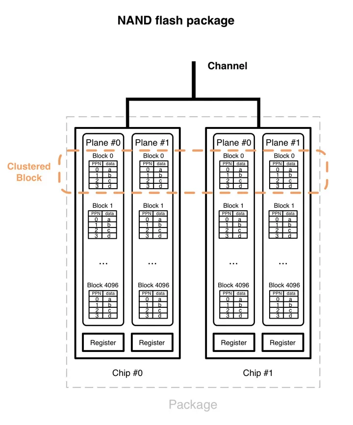

# Web-Based Flash SSD Simulator: Exploring the Inner Workings of Solid-State Drives
Welcome to the Flash SSD Simulator! This simulator allows you to experience the inner workings of a flash-based Solid-State Drive (SSD) right from your web browser. Whether you're a student studying computer architecture or a curious tech enthusiast, this simulator provides a hands-on understanding of the key operations and concepts related to flash SSDs.

## Enjoy the Simulation
Click [here](https://schoolofthought.tech/templates/flash_memory.html) to dive into the Flash SSD Simulation and explore its interactive features. Gain insights into the intricate processes and components involved in the operation of a Flash SSD.

## Read:
&nbsp;&nbsp;&nbsp;&nbsp;&nbsp;&nbsp;&nbsp;&nbsp;&nbsp;Upload a file to the simulator and observe the read operation in action. Gain insights into how the SSD retrieves data from the flash memory cells and transfers it to the system.

## Write:
&nbsp;&nbsp;&nbsp;&nbsp;&nbsp;&nbsp;&nbsp;&nbsp;&nbsp;Experience the write operation by uploading a file to the simulator. Understand how the SSD stores data in its flash memory cells and organizes it efficiently for quick retrieval.

## Garbage Collection:
&nbsp;&nbsp;&nbsp;&nbsp;&nbsp;&nbsp;&nbsp;&nbsp;&nbsp;Witness the intelligent garbage collection process in action. Learn how the SSD manages free space by reclaiming invalid or deleted data, ensuring optimal utilization of the flash memory.

## Mapping (VP to PA):
&nbsp;&nbsp;&nbsp;&nbsp;&nbsp;&nbsp;&nbsp;&nbsp;&nbsp;Explore the mapping process that converts virtual addresses (VAs) to physical addresses (PAs) within the SSD. Understand how the controller maps logical blocks to specific physical locations, enabling efficient read and write operations.

## Wear Leveling:
&nbsp;&nbsp;&nbsp;&nbsp;&nbsp;&nbsp;&nbsp;&nbsp;&nbsp;Discover the crucial wear leveling mechanism employed by flash SSDs. Observe how the simulator distributes write operations evenly across the memory cells, extending the lifespan and endurance of the SSD.

## Write Amplification:
&nbsp;&nbsp;&nbsp;&nbsp;&nbsp;&nbsp;&nbsp;&nbsp;&nbsp;Delve into the concept of write amplification, a critical metric for flash SSD performance. Gain insights into how the simulator minimizes write amplification by optimizing the write operations and reducing unnecessary data movements.

## Trim Command:
&nbsp;&nbsp;&nbsp;&nbsp;&nbsp;&nbsp;&nbsp;&nbsp;&nbsp;Learn about the Trim command, an essential feature for maintaining SSD performance. Explore how the simulator handles Trim commands to improve the efficiency of garbage collection and reduce write amplification.

## Over-provisioning:
&nbsp;&nbsp;&nbsp;&nbsp;&nbsp;&nbsp;&nbsp;&nbsp;&nbsp;Understand the significance of over-provisioning in flash SSDs. Experience how the simulator reserves a portion of the flash memory for background operations, enhancing performance, and extending the SSD's lifespan.

By providing this comprehensive range of functionalities, the Flash SSD Simulator offers an interactive and educational environment for users to explore the inner workings of flash-based SSDs. It enables users to develop a deeper understanding of the technology behind SSDs and the factors that influence their performance and longevity. So go ahead, dive in, and experience the fascinating world of flash SSDs firsthand!

## Table 01: Specifications of a NAND Flash Device
| Parameter | Value |
|----------|----------|
Page Size | 4 KB
Block Size | 256 KB (64 pages)
Page Read | 25 μs
Page Program (Write) | 200 μs
Block Erase | 1.5 ms

## Figure 01: Internal Architecture of a Typical NAND Flash Device

&nbsp;&nbsp;&nbsp;&nbsp;&nbsp;&nbsp;&nbsp;&nbsp;&nbsp; Figure 01 above shows the internals of a NAND-flash package, which is organized as a hierarchical structure. The levels are channel, package, chip, plane, block, and page. Those different levels offer parallelism as follows:

1. Channel-level parallelism:  The flash controller communicates with the flash packages through multiple channels. Those channels can be accessed independently and simultaneously. Each individual channel is shared by multiple packages.

2. Package-level parallelism: The packages on a channel can be accessed independently. Interleaving can be used to run commands simultaneously on the packages shared by the same channel.

3. Chip-level parallelism: A package contains two or more chips, which can be accessed independently in parallel. Note: chips are also called “dies”.

4. Plane-level parallelism: A chip contains two or more planes. The same operation (read, write or erase) can be run simultaneously on multiple planes inside a chip. Planes contain blocks, which themselves contains pages. The plane also contains registers (small RAM buffers), which are used for plane-level operations.

## License
This simulation is provided under the [MIT License](LICENSE). You are free to use, modify, and distribute the simulation in accordance with the terms of the license.

